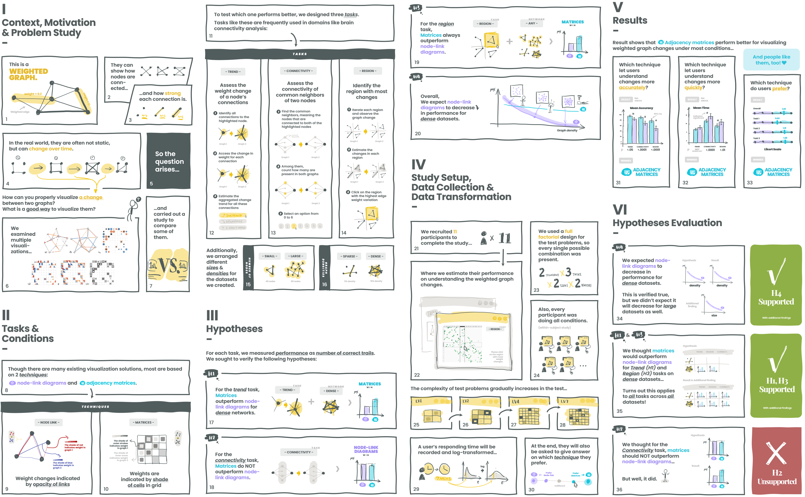

## Card-Based Approach to Engage Exploring Ethics in AI for Data Visualization

Zezhong Wang, Shan Hao, Sheelagh Carpendale, *Extended Abstracts of the CHI Conference on Human Factors in Computing Systems (CHI EA '24), May 11--16, 2024, Honolulu, HI, USA*. ****

<!-- <iframe width="560" height="315" src="https://www.youtube.com/embed/k9kM30ThPg4" allow="accelerometer; autoplay; clipboard-write; encrypted-media; gyroscope; picture-in-picture" allowfullscreen></iframe> -->

<!--  -->
